# AIS | Module 1 | Tupichenko Mila | P3309

---

# Введение

## Лабораторная работа №1

### Цель

> Создание базы знаний в языке программирования Prolog и реализовывание набора запросов, используя созданную базу
> знаний. Получить и развить навыков работы с фактами, предикатами, и правилами в логическом программировании.

## Лабораторная работа №2

### Цель

> Познакомиться со средой разработки онтологий Protege и перевод базы знаний, созданной в предыдущей лабораторной работе
> в онтологическую форму в Protege.

# Анализ требований

## Лабораторная работа №1

### Требования и задачи

### Часть 1

- **Cоздание базы знаний:**

  Создайте базу знаний. База знаний должна включать в себя **не менее 20 фактов с одним аргументом, 10-15 фактов с двумя
  аргументам, которые дополняют и показывают связь с другими фактами и 5-7 правил.** Факты могут описывать объекты, их
  свойства и отношения между ними. Факты 2 и более аргументами могут описывать различные атрибуты объектов, а правила -
  логические законы и выводы, которые можно сделать на основе фактов и предикатов.

- **Выполнение запросов:**

  Напишите несколько запросов для БЗ. Запросы **должны быть разной сложности** и включать в себя:

    - Простые запросы к базе знаний для поиска фактов.
    - Запросы, использующие логические операторы (**и, или, не**) для формулирования сложных условий (или использовать
      логические операторы в правилах).
    - Запросы, использующие переменные для поиска объектов с определенными характеристиками.
    - Запросы, которые требуют выполнения правил для получения результата.
- **Документация:**

  В коде должны быть комментарии описания фактов, предикатов и правил.

### Часть 2

- **Задание**

  Преобразовать факты и отношения из Prolog в концепты и свойства в онтологии. Описать классы и свойства в онтологии,
  которые соответствуют объектам и отношениям из базы знаний. Например, если у были классы "Человек" и "Машина" и
  свойство "возраст", создайте аналогичные классы и свойства в онтологии в Protege.

## Лабораторная работа №2

### Требования и задачи

- **Задание**
    - Создать программу, которая позволяет пользователю ввести запрос через командную строку. Например, информацию о
      себе, своих интересах и предпочтениях в контексте выбора видеоигры - на основе фактов из БЗ (из первой лабы)
      /Онтологии(из второй).
    - Использовать введенные пользователем данные, чтобы выполнить логические запросы к БЗ/Онтологии.
    - На основе полученных результатов выполнения запросов, система должна предоставить рекомендации или советы,
      связанные с выбором из БЗ или онтологии.
    - Система должна выдавать рекомендации после небольшого диалога с пользователем.
- **Нужно**

  Спарсить строку, разбить на факты, построить запрос, используя эти предикаты. *(Формат входной строки фиксированный,
  искать частичное соответсвие подстроки не нужно)*

# Лабораторная работа №1

## Изучение основных концепций и инструментов

В ходе выполнения лабораторной работы я изучила [методическое пособие](https://books.ifmo.ru/file/pdf/3308.pdf) по
“Системам Искусственного Интелекта”, а точнее весь первый модуль. Узнала, что такое `Базы Знаний` , `Онтологии` ,
`Prolog` и `Protege` , а дальше начала выполнять первую лабораторную работу

## Ход работы

### Выбор тематики Базы Знаний

Мой взгляд пал на вселенную игры `Stardew Valley` , так что и все работы в первом модуле выполнялись на основе этой
игры.

Для первой лабораторной работы я занесла всех персонажей в базу знаний, определила `факты` и `правила` внутри
исполняемого файла Базы Знаний. В отдельном файле выписала `Запросы` , чтобы не забыть их


> **Изначальная версия первой лабораторной работы *“слегка”* изменилась, так как во второй мне потребовались
дополнительные факты и классы. Онтология строилась по первой версии Базы Знаний**
>
>*Далее представлена первая версия работы, как она была сдана. Вторая версия будет так же представлена ниже, но она так
же менялась, потому что во второй лабораторной работе не нужен был текстовый вывод строк*

### Prolog KB v 1.0.0

```prolog

% Married characters
married("Caroline").
married("Demetrius").
married("Evelyn").
married("George").
married("Jodi").
married("Kent").
married("Robin").
married("Pam").
married("Marnie").
married("Lewis").

% Bachelors
bachelor("Alex").
bachelor("Elliott").
bachelor("Harvey").
bachelor("Sam").
bachelor("Sebastian").
bachelor("Shane").

% Bachelorettes
bachelorette("Abigail").
bachelorette("Emily").
bachelorette("Haley").
bachelorette("Leah").
bachelorette("Maru").
bachelorette("Penny").

% Children
child("Jas").
child("Vincent").
child("Leo").

% Spouse relationships (canon couples)
spouse("Kent", "Jodi").
spouse("Jodi", "Kent").
spouse("Demetrius", "Robin").
spouse("Robin", "Demetrius").
spouse("Caroline", "Pierre").
spouse("Pierre", "Caroline").
spouse("Evelyn", "George").
spouse("George", "Evelyn").

% Parent relationships
parent("Kent", "Sam").
parent("Kent", "Vincent").
parent("Jodi", "Sam").
parent("Jodi", "Vincent").

parent("Robin", "Sebastian").
parent("Robin", "Maru").
parent("Demetrius", "Maru").

parent("Caroline", "Abigail").
parent("Pierre", "Abigail").

parent("Pam", "Penny").
parent("Lewis", "Alex").
parent("Marnie", "Alex").

parent("Evelyn", "Marnie").
parent("George", "Marnie").

%rules

divorced(X) :- 
	married(X),       % X is in married list
      	\+ spouse(X, _).  % but have no couple in spouse list

siblings(X, Y) :-
       	parent(Z, X), %Z is a parent of X%
       	parent(Z, Y), % Z is a parent of Y
	Y \= X.     % it's not the same person

grandparent(X, Y) :- 
	parent(X, Z), % X is a parent of Z
	parent(Z, Y).  % when Z is a parent of Y

half_siblings(S1, S2):-
	parent(P1, S1),  %P1 is parent of the first child
	spouse(P1, P2),  %P1 is P2 husband or wife
       	parent(P2, S2),  %find the second sibling, whose parent is P2
	S1 \= S2,        % S1 and S2 cannot be one person
       	P1 \= P2, 	 % parents also couldn't be one person
	not(parent(P2,S1)).  %the second parent can't be bio-parent of the first child )

```

### Prolog KB v 1.0.1

```prolog
:- discontiguous(spouse/2).
:- dynamic(friend/2).
:- dynamic(friendship_level/3).

% Age class
age(child).
age(teenager).
age(young_adult).
age(adult).
age(elder).

% Sex class
sex(male).
sex(female).

% Residents class
resident(abigail, female, young_adult).
resident(alex, male, young_adult).
resident(caroline, female, adult).
resident(clint, male, adult).
resident(demetrius, male, adult).
resident(elliott, male, adult).
resident(emily, female, adult).
resident(evelyn, female, elder).
resident(george, male, elder).
resident(gus, male, elder).
resident(haley, female, young_adult).
resident(jas, female, child).
resident(jodi, female, adult).
resident(kent, male, adult).
resident(leah, female, adult).
resident(lewis, male, elder).
resident(linus, male, elder).
resident(maru, female, young_adult).
resident(marnie, female, adult).
resident(pam, female, adult).
resident(penny, female, young_adult).
resident(pierre, male, adult).
resident(robin, female, adult).
resident(sam, male, young_adult).
resident(sandy, female, adult).
resident(sebastian, male, young_adult).
resident(shane, male, adult).
resident(vincent, male, child).

% Spouses class
spouse(kent, jodi).
spouse(demetrius, robin).
spouse(caroline, pierre).
spouse(evelyn, george).
spouse(marnie, lewis).

% Parents class
parent(kent, sam).
parent(kent, vincent).
parent(jodi, sam).
parent(jodi, vincent).
parent(robin, sebastian).
parent(robin, maru).
parent(demetrius, maru).
parent(caroline, abigail).
parent(pierre, abigail).
parent(pam, penny).
parent(lewis, alex).
parent(marnie, alex).
parent(evelyn, marnie).
parent(george, marnie).

% friends facts
friend(abigail, haley).
friend(haley, abigail).

% frienship level facts
friendship_level(abigail, haley, 5).
friendship_level(haley, abigail, 5).

% consts for max and min level of frienship
max_friendship_level(10).
min_friendship_level(-5).

% available gifts with point of their effects
gift_effect(chocolate_cake, 2).
gift_effect(pufferfish, -4).
gift_effect(ice_cream, 3).
gift_effect(coffee, 1).
gift_effect(dandelion, 0).
gift_effect(tulip, 1).
gift_effect(starfruit, 4).
gift_effect(amethyst, 3).
gift_effect(diamond, 5).

% rules

% child rule
child(C, P) :- parent(P, C).

%grandparent rule
grandparent(G, C) :- parent(G, P), parent(P, C).

% rule for symmetric spouse fact 
% Y@<X - we are check if pair spouse(Y, X) is already exist, we don't need to create
% one more pair: spouse (X, jodi) -> spouse (kent, jodi) 
% in other hand, if "Y less than X", we check pair (Y, X): if this pair exists, then 
% pair (X, Y) also can be created
spouse(X, Y) :- Y @< X, spouse(Y, X), !.

% step-siblings rule (find 1 parent -> find ther spouse -> find spouse child -> check
% that siblings and parents not one persone -> then check that 1 parent not a bio-parent
% for second sibling)
step-siblings(S1, S2):-
	parent(P1, S1),  
	spouse(P1, P2),  
    parent(P2, S2), 
	S1 \= S2,       
    P1 \= P2, 	
	not(parent(P2,S1)).

% sibling rule
siblings(X, Y) :-
    parent(Z, X),
    parent(Z, Y), 
	Y \= X.    

% literally unnecessary rules 
residents_by_age(N, A) :- resident(N, _, A).
residents_by_sex(N, S) :- resident(N, S, _).

% making two persons friends
make_friends(Person1, Person2) :-
% if two args not one person but pair friend(X, Y) or friend(Y, X) exists -> false
    ( Person1 \= Person2, (friend(Person1, Person2) ; friend(Person2, Person1))  
    ->  write(Person1), write(' и '), write(Person2), write(' уже друзья!'), nl
    % else: write new facts: friend(X, Y) & friend(Y, X)
    ;   assertz(friend(Person1, Person2)),  
        assertz(friend(Person2, Person1)),
        write(Person1), write(' и '), write(Person2), write(' теперь друзья!'), nl
    ).

% gave gift from one frend to another 
gave_gift(Person, Friend, Gift) :-
		%if persons are friends
    ((friend(Person, Friend); friend(Friend, Person)) -> 
		    % and input gift exists
        (gift_effect(Gift, Effect) ->
		        % find friends friendship level (int)
            friendship_level(Person, Friend, CurrentLevel),
            % counting new friendship level, which based on gift effect
            NewLevel is CurrentLevel + Effect,
            % frienship level must be in [-5, 10] diapason, so cutting level
            clamp_friendship(NewLevel, ClampedLevel),
            % delete old frienship level
            retract(friendship_level(Person, Friend, CurrentLevel)),
            retract(friendship_level(Friend, Person, CurrentLevel)),
            % paste new friendship level
            assertz(friendship_level(Person, Friend, ClampedLevel)),
            assertz(friendship_level(Friend, Person, ClampedLevel)),
            % if friendship level less than -5 persons not friends anymore
            % so we need to check this
            check_friendship_status(Person, Friend, ClampedLevel)
            ;
            write('Подарка '), write(Gift), write(' не существует.'), nl
        );  write(Person), write(' и '), write(Friend), write(' не друзья!'), nl
    ).

% a rule of thumb to keep the friendship level within a given diapason [-5, 10]
clamp_friendship(Level, ClampedLevel) :-
    max_friendship_level(Max),
    min_friendship_level(Min),
    (Level > Max -> ClampedLevel = Max; 
     Level < Min -> ClampedLevel = Min; 
     ClampedLevel = Level).

% rule for checking is persons still friends after the gift 
check_friendship_status(Person, Friend, Level) :-
    min_friendship_level(Min),
    % if friendship level more than -5 then we go to another rule  version,
    Level =:= Min, !,
    % else we delete all facts about this friendship
    retract(friend(Person, Friend)),
    retract(friend(Friend, Person)),
    retract(friendship_level(Person, Friend, Level)),
    retract(friendship_level(Friend, Person, Level)),
    write(Person), write(' и '), write(Friend), write(' больше не друзья!'), nl.
    
% rule for checking is persons still friends after the gift 
check_friendship_status(Person, Friend, Level) :-
    max_friendship_level(Max),
    min_friendship_level(Min),
    % if everything is okay, we write message
    Level > Min, Level =< Max, !,
    write(Person), write(' и '), write(Friend), write(' друзья! Уровень дружбы: '), write(Level), nl.

% simple rule for checking friendship level 
check_friendship(Person, Friend) :-
    (friendship_level(Person, Friend, Level) ->  write(Person), write(' и '), write(Friend), write(' друзья! Уровень дружбы: '), write(Level), nl ;
    write(Person), write(' и '), write(Friend), write(' не друзья!'), nl).

% list of all available gifts with their effects
list_gifts :-
    findall((Gift, Effect), gift_effect(Gift, Effect), GiftEffects),
    (   GiftEffects \= []
    ->  write('Список всех подарков и их эффектов:'), nl,
        print_gift_effects(GiftEffects)
    ;   write('Нет доступных подарков.'), nl
    ).

%printers for gifts
print_gift_effects([]).
print_gift_effects([(Gift, Effect)|Rest]) :-
    write(Gift), write(': Уровень дружбы изменяется на '), write(Effect), nl,
    print_gift_effects(Rest).

% list all friends of specific person
list_friends(Person) :-
    findall(Friend, friend(Person, Friend), Friends), 
    (Friends = [] ->
        write(Person), write(' не имеет друзей.'), nl
        ;
        write(Person), write(' имеет следующих друзей: '),
        write_list(Friends), 
        nl
    ).

% printers for list of friends
write_list([]).
write_list([H|T]) :-
    (T = [] -> write(H), write('.'), !; write(H), write(', '), write_list(T)).

% list of all friends for all residents
list_all_friends :-
    findall(Person, resident(Person, _, _), Residents),
    print_all_friends(Residents), !.

print_all_friends([]).
print_all_friends([Person | Rest]) :-
    list_friends(Person),  
    print_all_friends(Rest).  
```

## Онтология в Protege

### **Классы**

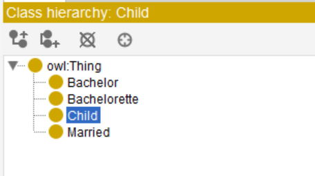

### **Сущности класса (факты с одним аргументом)**

1. Bachelors

   

2. Bachelorettes

   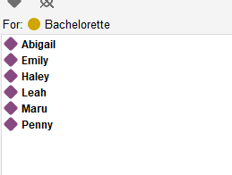

3. Married

   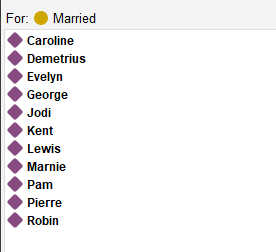

4. Child

   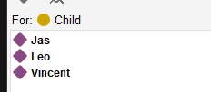

### Свойства объектов (правила)

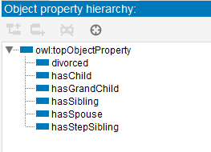

### Итоговый граф

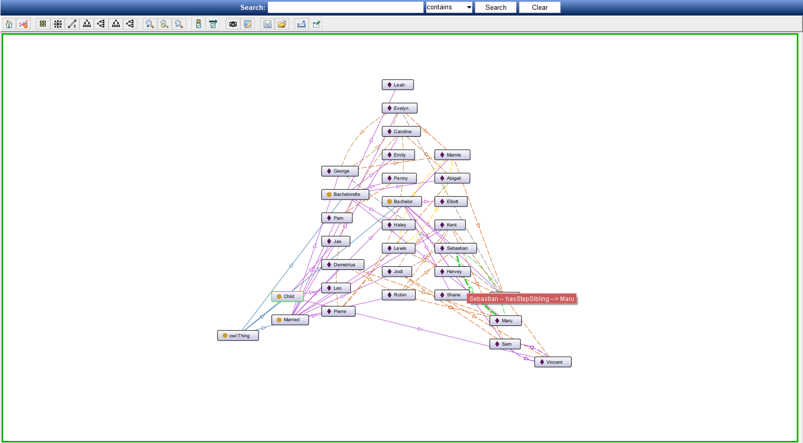

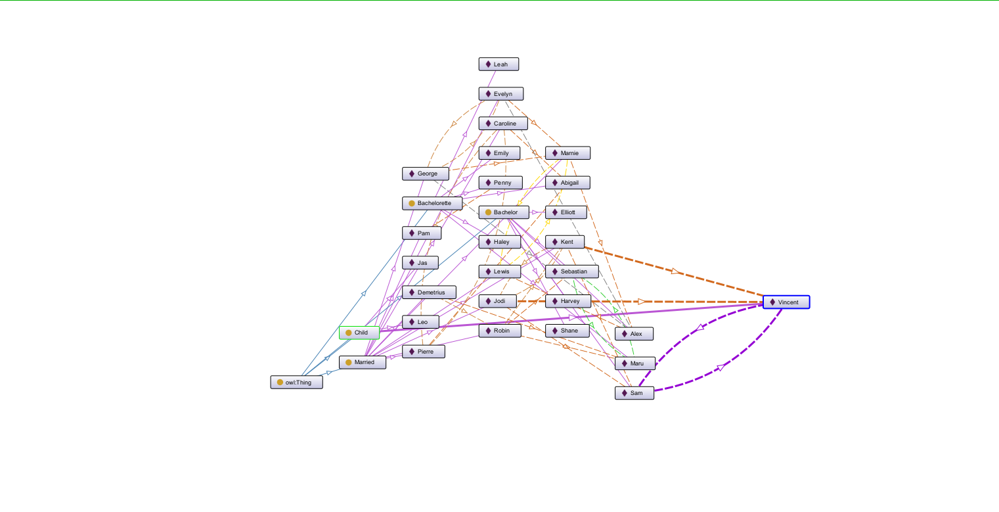

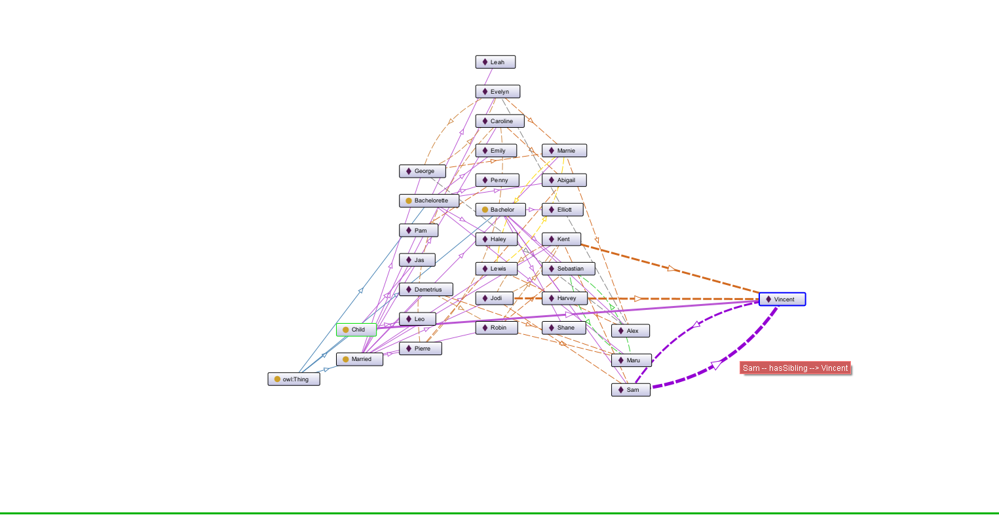

# Лабораторная работа №2

## Изучение основных концепций и инструментов

На базе `Первой Лабораторной Работы` мне нужно было разработать программу (рекомендательную систему), которая бы
взаимодействовала со сделанной базой знаний. Выбор пал на `Python` , как на язык разработки, так как в нем имеются
неплохие библиотеки для работы с базами знания `Prolog.` Я долго выбирала между `SwiProlog` и `Pyswip`  (библиотеки,
предоставляющие инструментарий для работы с  `Prolog` и `Python` ), но по итогу выбрала `SwiProlog`, так как
документация у него была приятнее

## Ход работы

### Измененная База Знаний

Первым делом, я поменяла базу знаний из первой работы, так как она оказалсь слишком маленькой и неполной для моих
амбиций на вторую лабораторную работу, так что финальная версия базы знаний выглядит так

```prolog
:- discontiguous(spouse/2).
:- dynamic(friend/2).
:- dynamic(friendship_level/3).

% Age class
age(child).
age(teenager).
age(young_adult).
age(adult).
age(elder).

% Sex class
sex(male).
sex(female).

% Residents class
resident(abigail, female, young_adult).
resident(alex, male, young_adult).
resident(caroline, female, adult).
resident(clint, male, adult).
resident(demetrius, male, adult).
resident(elliott, male, adult).
resident(emily, female, adult).
resident(evelyn, female, elder).
resident(george, male, elder).
resident(gus, male, elder).
resident(haley, female, young_adult).
resident(jas, female, child).
resident(jodi, female, adult).
resident(kent, male, adult).
resident(leah, female, adult).
resident(lewis, male, elder).
resident(linus, male, elder).
resident(maru, female, young_adult).
resident(marnie, female, adult).
resident(pam, female, adult).
resident(penny, female, young_adult).
resident(pierre, male, adult).
resident(robin, female, adult).
resident(sam, male, young_adult).
resident(sandy, female, adult).
resident(sebastian, male, young_adult).
resident(shane, male, adult).
resident(vincent, male, child).

% Spouses class
spouse_canon(kent, jodi).
spouse_canon(demetrius, robin).
spouse_canon(caroline, pierre).
spouse_canon(evelyn, george).
spouse_canon(marnie, lewis).

% Parents class
parents(kent, sam).
parents(kent, vincent).
parents(jodi, sam).
parents(jodi, vincent).
parents(robin, sebastian).
parents(robin, maru).
parents(demetrius, maru).
parents(caroline, abigail).
parents(pierre, abigail).
parents(pam, penny).
parents(lewis, alex).
parents(marnie, alex).
parents(evelyn, marnie).
parents(george, marnie).

friend(abigail, haley).
friend(haley, abigail).

friendship_level(abigail, haley, 5).
friendship_level(haley, abigail, 5).

max_friendship_level(10).
min_friendship_level(-5).

gift_effect(chocolate_cake, 2).
gift_effect(pufferfish, -4).
gift_effect(ice_cream, 3).
gift_effect(coffee, 1).
gift_effect(dandelion, 0).
gift_effect(tulip, 1).
gift_effect(starfruit, 4).
gift_effect(amethyst, 3).
gift_effect(diamond, 5).

% rules

children(C, P) :- parents(P, C).
grandparents(G, C) :- parents(G, P), parents(P, C).
spouse(X, Y) :- (spouse_canon(X, Y); spouse_canon(Y, X)), !.

step-siblings(S1, S2):-
	parents(P1, S1),
	spouse(P1, P2),
    parents(P2, S2),
	S1 \= S2,
    P1 \= P2,
	not(parents(P2,S1)).

siblings(X, Y) :-
    parents(Z, X),
    parents(Z, Y),
	Y \= X.

residents_by_age(N, A) :- resident(N, _, A).
residents_by_sex(N, S) :- resident(N, S, _).
list_all_residents :- findall((N, S, A), resident(N, S, A), Residents), Residents.

make_friends(Person1, Person2) :-
    ((friend(Person1, Person2) ; friend(Person2, Person1))
    ->  false
    ;( Person1 = Person2 -> false
       ;
       assertz(friend(Person1, Person2)),
       assertz(friend(Person2, Person1)),
       assertz(friendship_level(Person1, Person2, 0)),
       assertz(friendship_level(Person2, Person1, 0))
    )).

gave_gift(Person, Friend, Gift) :-
        (gift_effect(Gift, Effect) ->
            friendship_level(Person, Friend, CurrentLevel),
            NewLevel is CurrentLevel + Effect,
            clamp_friendship(NewLevel, ClampedLevel),
            retract(friendship_level(Person, Friend, CurrentLevel)),
            retract(friendship_level(Friend, Person, CurrentLevel)),
            assertz(friendship_level(Person, Friend, ClampedLevel)),
            assertz(friendship_level(Friend, Person, ClampedLevel))
            ;
            false
            ).

clamp_friendship(Level, ClampedLevel) :-
    max_friendship_level(Max),
    min_friendship_level(Min),
    (Level > Max -> ClampedLevel = Max;
     Level < Min -> ClampedLevel = Min;
     ClampedLevel = Level).

check_friendship_status(Person, Friend, Level) :-
    min_friendship_level(Min),
    Level =:= Min, !,
    retract(friend(Person, Friend)),
    retract(friend(Friend, Person)),
    retract(friendship_level(Person, Friend, Level)),
    retract(friendship_level(Friend, Person, Level)),
    false.

check_friendship_status(Person, Friend, Level) :-
    Person \= Friend,
    max_friendship_level(Max),
    min_friendship_level(Min),
    Level > Min, Level =< Max, !.

check_friendship(Person, Friend) :-
    (friendship_level(Person, Friend, Level) ->  write(Person), write(' и '), write(Friend), write(' друзья! Уровень дружбы: '), write(Level), nl ;
    false).

list_gifts(GiftEffects) :-
    findall([Gift, Effect], gift_effect(Gift, Effect), GiftEffects).

print_gift_effects([]).
print_gift_effects([(Gift, Effect)|Rest]) :-
    write(Gift), write(': Уровень дружбы изменяется на '), write(Effect), nl,
    print_gift_effects(Rest).

list_friends(Person) :-
    findall(Friend, friend(Person, Friend), Friends),
    (Friends = [] ->
        write(Person), write(' не имеет друзей.'), nl
        ;
        write(Person), write(' имеет следующих друзей: '),
        write_list(Friends),
        nl
    ).

write_list([]).
write_list([H|T]) :-
    (T = [] -> write(H), write('.'), !; write(H), write(', '), write_list(T)).

list_all_friends :-
    findall(Person, resident(Person, _, _), Residents), write(Residents).
```

### Код программы

### Полный код можно посмотреть тут - https://github.com/lunghr/artificial-intelligence-systems-module-1

# Примеры выполнения программ

## Лабораторная  работа №1

### `list_all_friends.`

```prolog
?- list_all_friends.
abigail имеет следующих друзей: haley.
alex не имеет друзей.
caroline не имеет друзей.
clint не имеет друзей.
demetrius не имеет друзей.
elliott не имеет друзей.
emily не имеет друзей.
evelyn не имеет друзей.
george не имеет друзей.
gus не имеет друзей.
haley имеет следующих друзей: abigail.
jas не имеет друзей.
jodi не имеет друзей.
kent не имеет друзей.
leah не имеет друзей.
lewis не имеет друзей.
linus не имеет друзей.
maru не имеет друзей.
marnie не имеет друзей.
pam не имеет друзей.
penny не имеет друзей.
pierre не имеет друзей.
robin не имеет друзей.
sam не имеет друзей.
sandy не имеет друзей.
sebastian не имеет друзей.
shane не имеет друзей.
vincent не имеет друзей.
true.
```

### `make_friends(haley, sam). -> list_friends(haley).`

```prolog
?- make_friends(haley, sam).
haley и sam теперь друзья!
true.

?- list_friends(haley).
haley имеет следующих друзей: abigail, sam.
true.
```

### `step-siblings(X,Y).`

```prolog
?- step-siblings(X,Y).
X = sebastian,
Y = maru ;
false.
```

### `spouse(jodi,X). -> spouse(kent, X). - check symmetry rule`

```prolog
?- spouse(jodi, X).
X = kent.

?- spouse(kent, X).
X = jodi ;
```

### `Ruin Haley & Sam friendship`

```prolog
?- make_friends(haley,sam).
haley и sam теперь друзья!
true.

?- check_friendship(haley,sam).
haley и sam друзья! Уровень дружбы: 0
true.

?- gave_gift(sam,haley,pufferfish).
sam и haley друзья! Уровень дружбы: -4
true.

?- gave_gift(sam,haley,pufferfish).
sam и haley больше не друзья!
true.

?- check_friendship(haley,sam).
haley и sam не друзья!
true.
```

## Лабораторная работа №2

### `initialization -> help command`

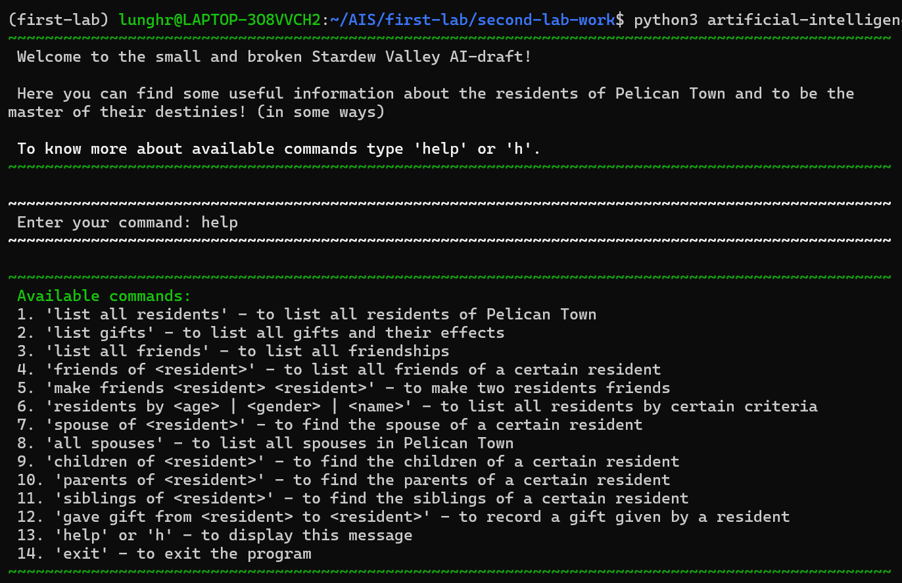

### `list all residents`

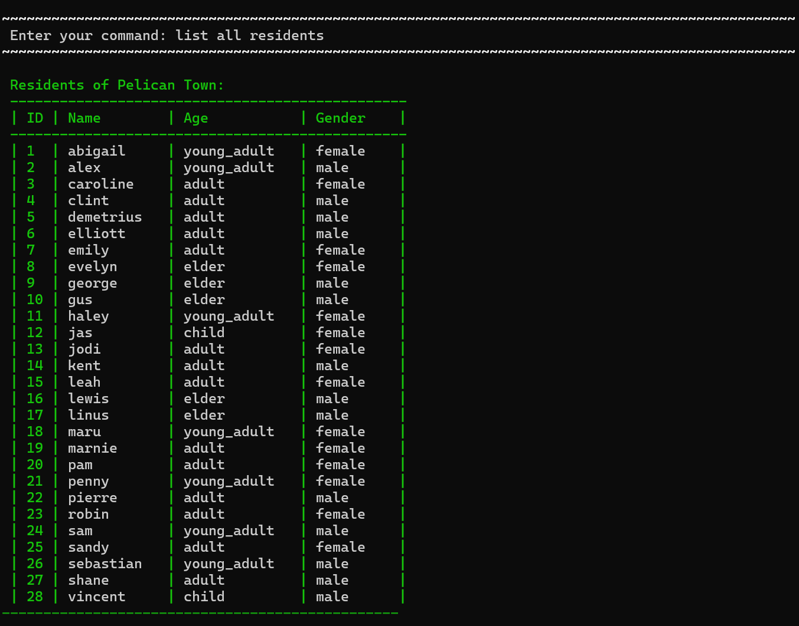

### `list gifts`

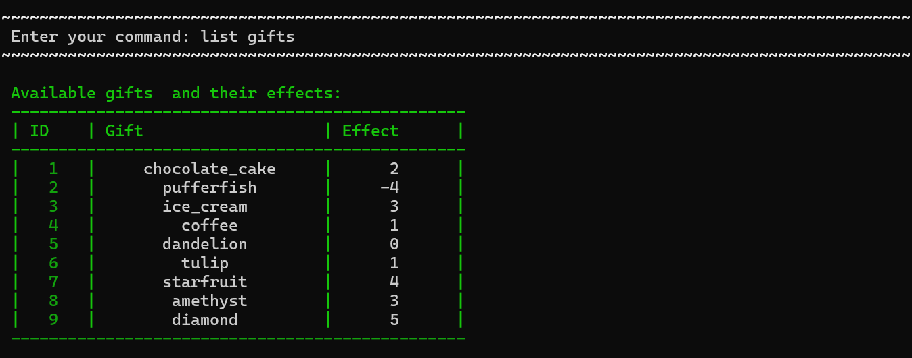

### `list all friends`

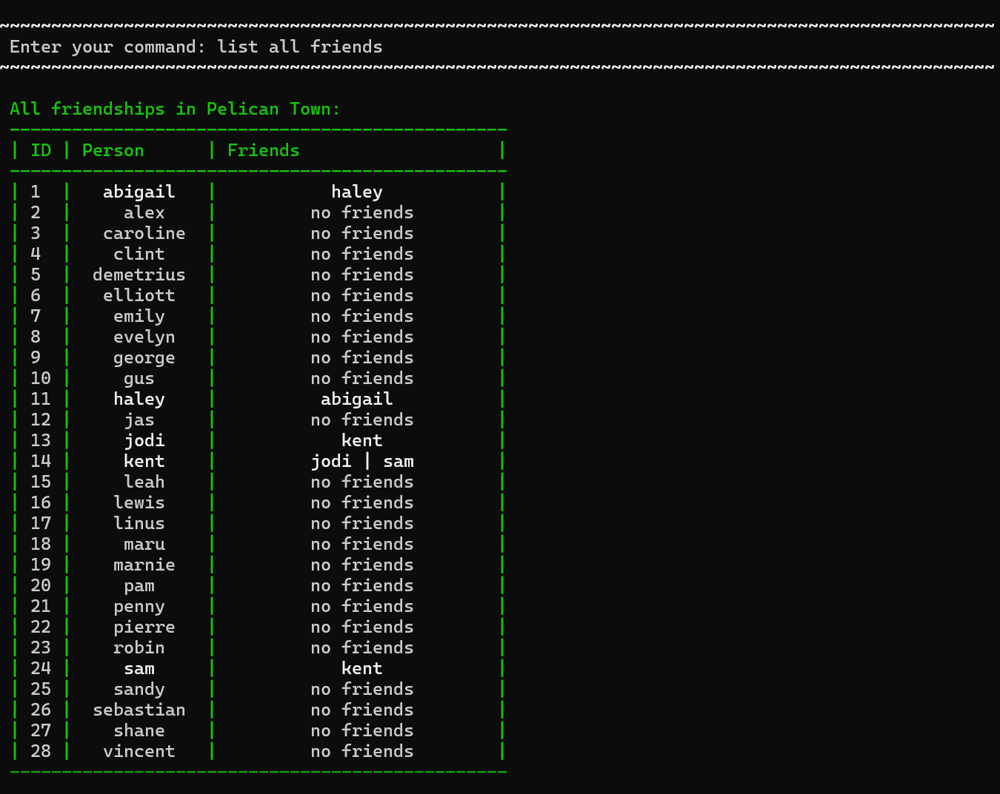

### `friends of <resident>`

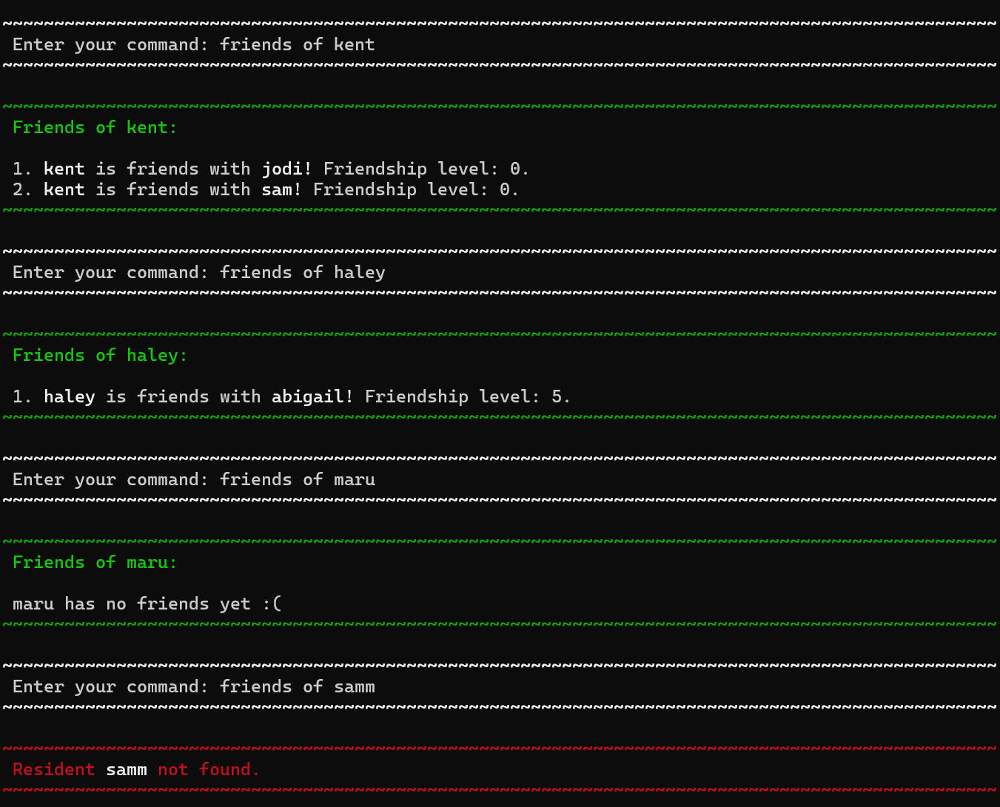

### `make friends <resident> <resident>`

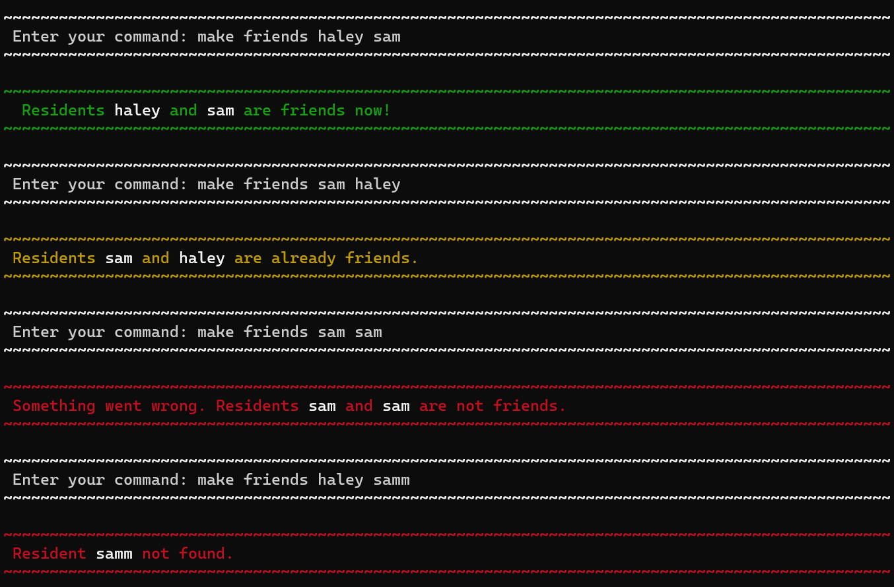

### `residents by <age> | <gender> | <name> <argument>`

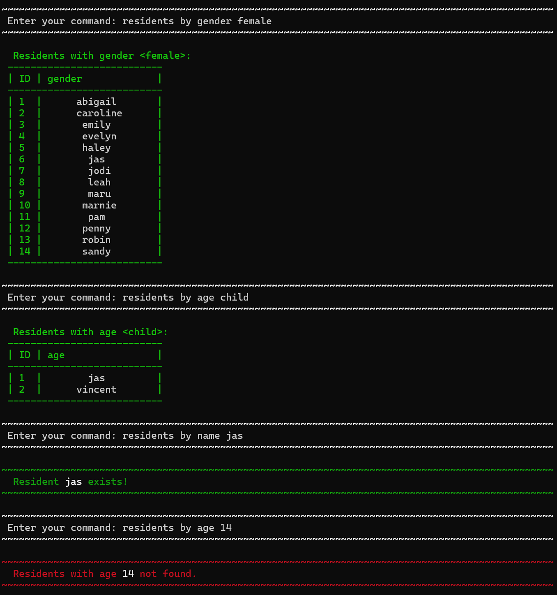

### `spouse of <resident>`

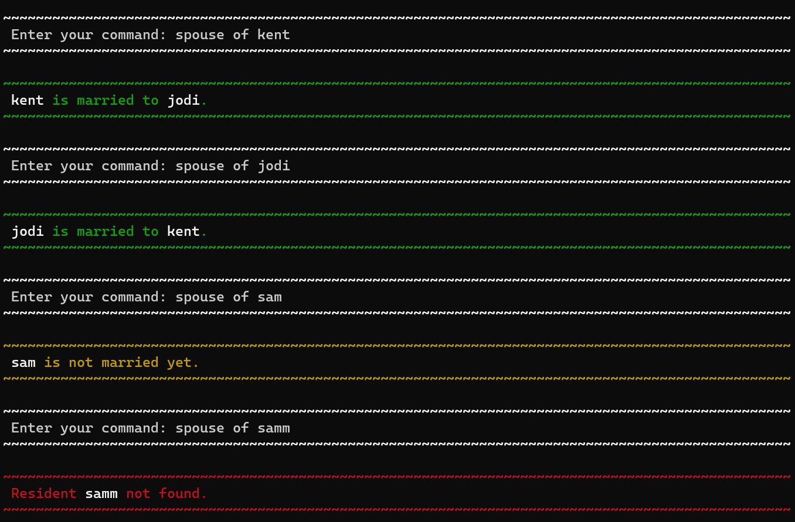

### `all spouses`

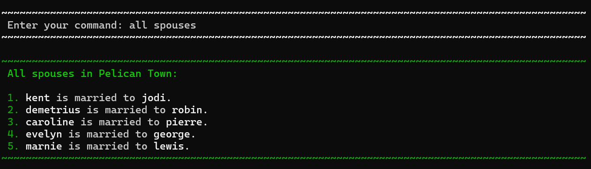

### `children of <resident>`

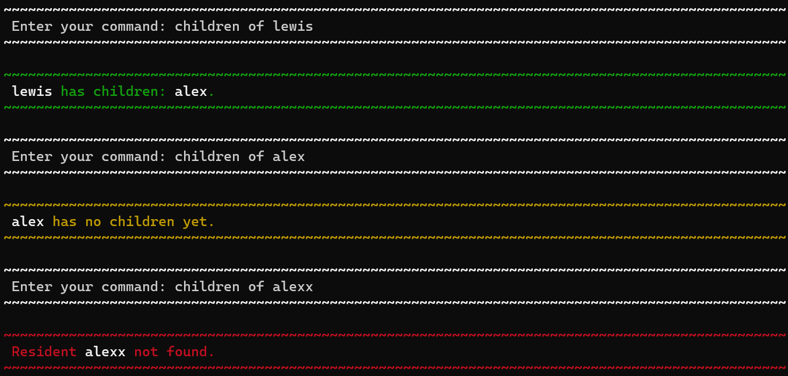

### `parents of <resident>`

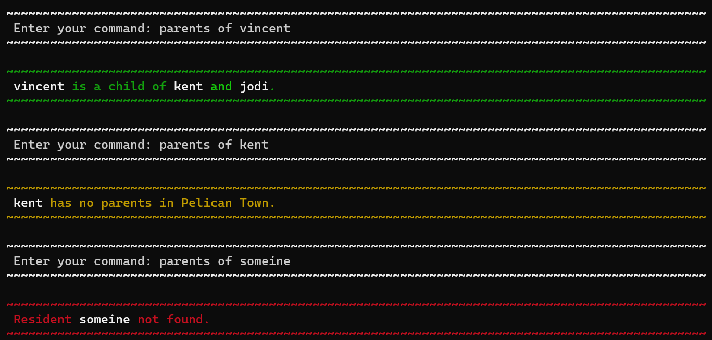

### `siblings of <resident>`

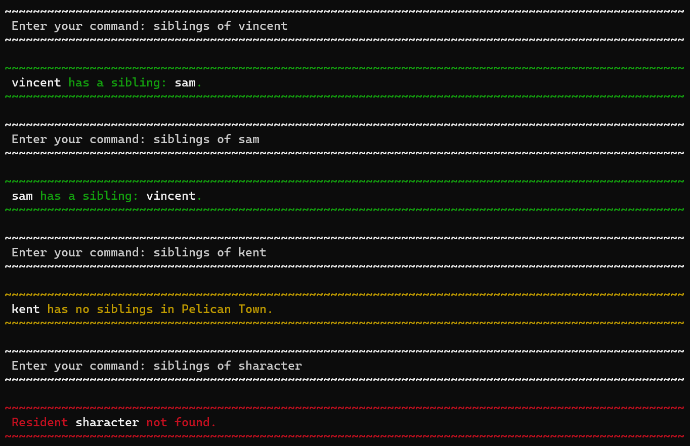

### `gave gift from <resident> to <resident>`

- **ruin friendship**

  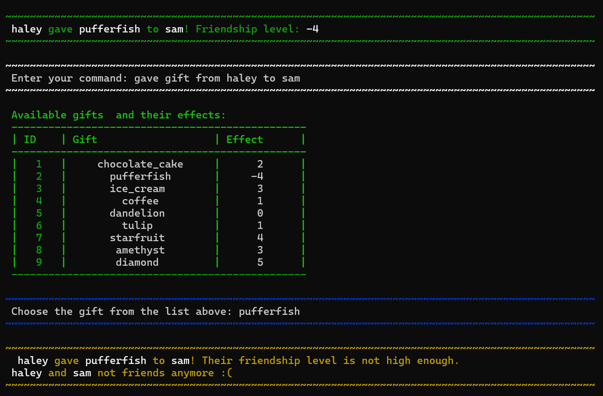

- **level up friendship**

  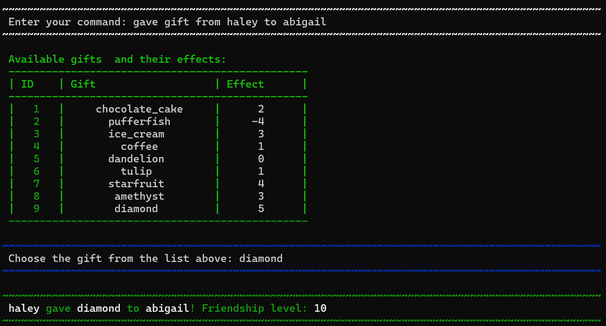

- **command exceptions validation**

  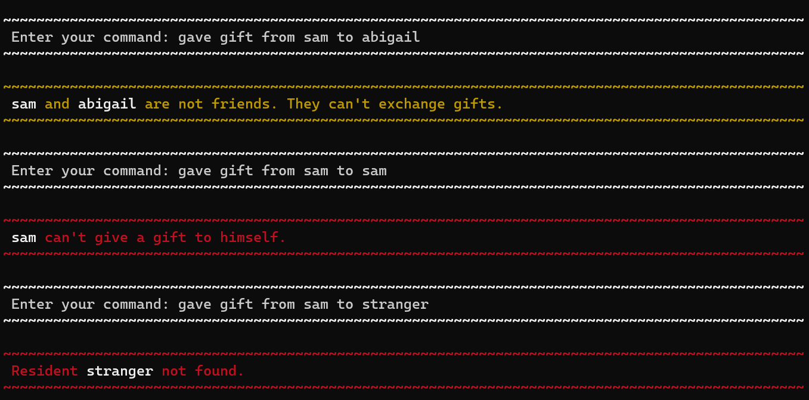

### `exit`

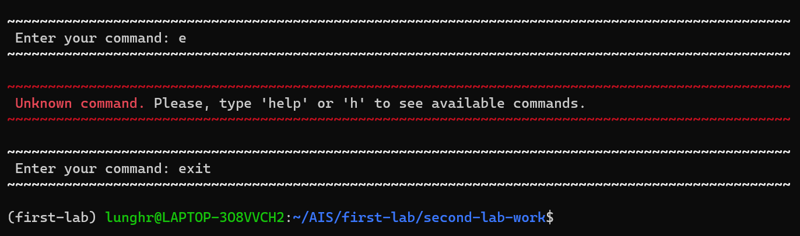

# Заключение

До выполнения лабораторных работ данного модуля я в целом не знала о существовании `Prolog` и `Protege` .

Первая лабораторная работа была не самой интересной, но тематика базы знаний скрасила написание правил и фактов, а
главное их придумывание.

Вторая лабораторная работа была интересной, да и полезной, в принципе. Я узнала про `SWI-Prolog` библиотеку для `Python`
и написала смешное консольно приложение в свое удовольствие

До начала выполнения лабораторных работ в рамках этого модуля я не знала о существовании  `Prolog` и `Protege`. Это были
для меня новые концепции, но при этом чтение о них в [методическом пособии](https://books.ifmo.ru/file/pdf/3308.pdf)
было довольно увлекательным и не отягощало. В общем, было познавательно, хоть и не особо актуально

Первая лабораторная работа, посвященная созданию базы знаний, не оказалась особенно увлекательной, но писать базу знаний
на основе Stardew Valley было забавно, поэтому не так скучно. Создание онтологии в `Protege` было самой неприятно частью
работы, так как приходилось интуитивно разбираться в не самом удобном и новом интерфейсе, потому что какую-то
документацию и пояснения я найти не смоггла

Во второй лабораторной работе я столкнулась с `SWI-Prolog` — библиотекой для работы с `Prolog` в Python, и эта задача
оказалась более интересной и полезной. Я узнала о возможности интеграции `Prolog` с Python. Написала смешное консольно
приложение в свое удовольствие, большего мне и не надо, в принципе.

В целом, второй опыт с `Prolog` и Python был положительным, так как я смогла увидеть, как эти технологии могут
взаимодействовать и быть полезными в каких-нибудь (не думаю что очень реальных) проектах.